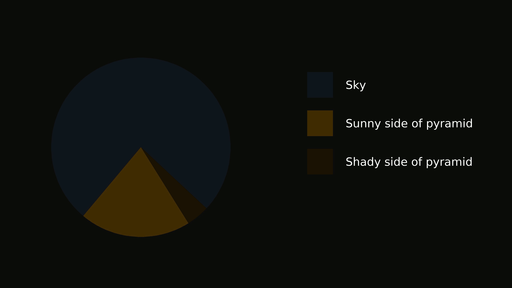
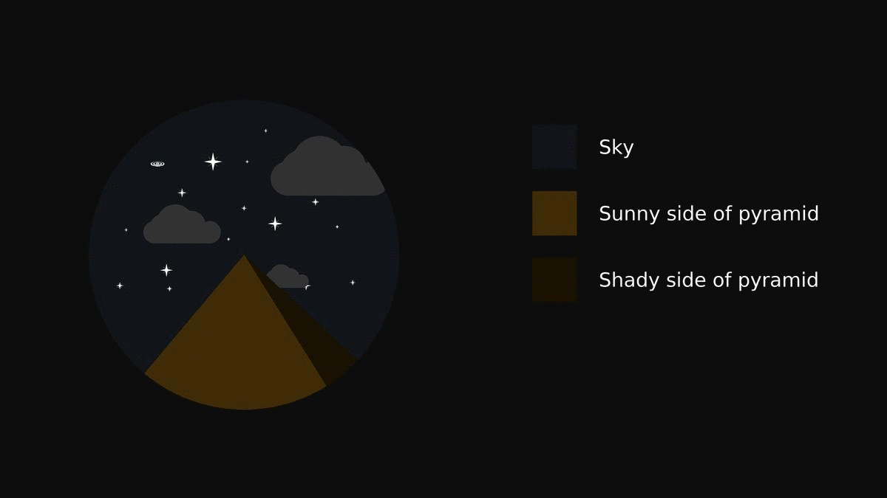

# Pyramids creator

### Results

#### Plain



#### Stars



### Change the desktop background

https://askubuntu.com/a/743024

### Add the job

https://askubuntu.com/a/738181

Put it in your crontab.

Open your cron table by:

```
crontab -e
```

Now add:

```
0 * * * * /path/to/desktop_changer.sh
```


