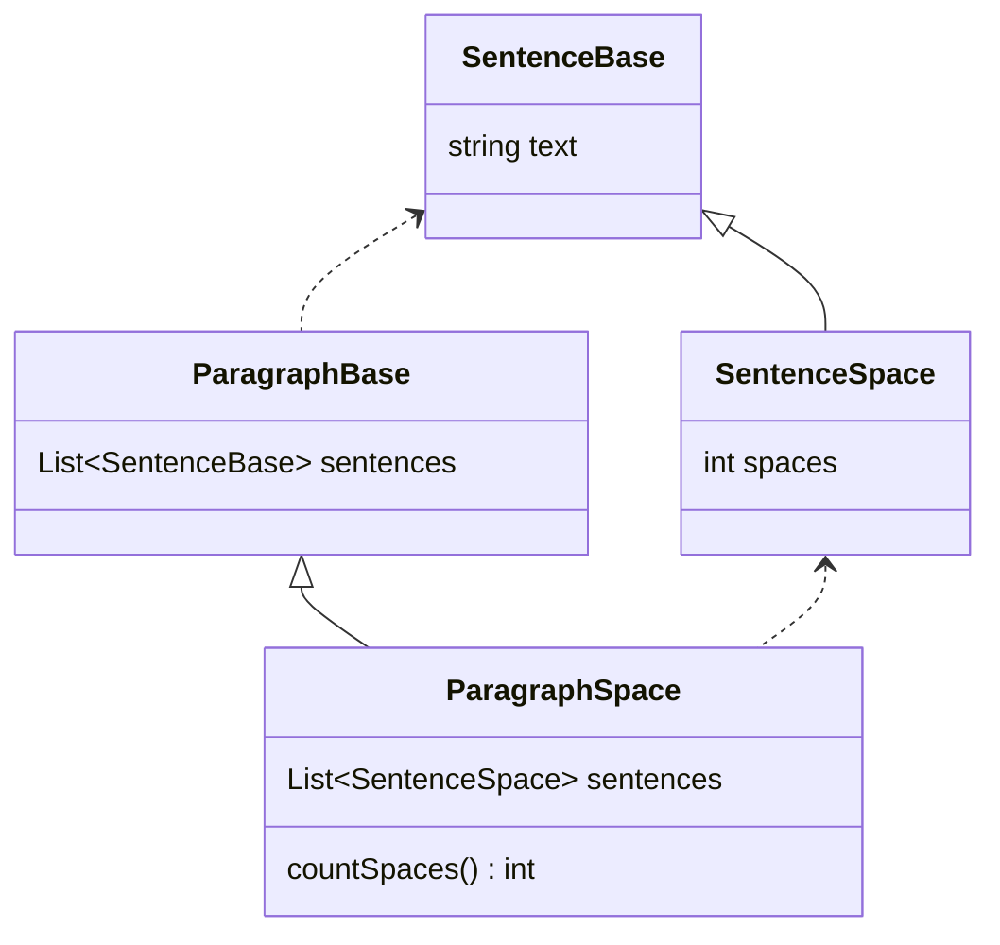

# Inheritance and member types

* https://en.wikipedia.org/wiki/Unified_Modeling_Language
* https://github.com/mermaid-js/mermaid/blob/develop/packages/mermaid/src/docs/syntax/classDiagram.md#defining-relationship
* https://www.ibm.com/docs/en/rational-soft-arch/9.7.0?topic=diagrams-dependency-relationships

There are eight different types of relations defined for classes under UML which are currently supported in `mermaid` diagrams:

| Type    | Description   |
| ------- | ------------- |
| `<\|--` | Inheritance   |
| `\*--`  | Composition   |
| `o--`   | Aggregation   |
| `-->`   | Association   |
| `--`    | Link (Solid)  |
| `..>`   | Dependency    |
| `..\|>` | Realization   |
| `..`    | Link (Dashed) |

and probably one of these is the right one for our problem.

Class `Paragraph` depends on `Sentence`.
The paragraph uses the sentences.
A change on sentence class might require a change in paragraph class.

